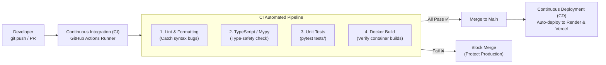

```mermaid
flowchart LR
    Dev["Developer\ngit push / PR"] --> CI["Continuous Integration (CI)\nGitHub Actions Runner"]

    subgraph CI_Pipeline["CI Automated Pipeline"]
        Lint["1. Lint & Formatting\n(Catch syntax bugs)"]
        Type["2. TypeScript / Mypy\n(Type-safety check)"]
        Test["3. Unit Tests\n(pytest tests/)"]
        DockerTest["4. Docker Build\n(Verify container builds)"]
    end

    CI --> CI_Pipeline
    CI_Pipeline -->|All Pass ✅| Merge["Merge to Main"]
    CI_Pipeline -->|Fail ❌| Block["Block Merge\n(Protect Production)"]
    Merge --> CD["Continuous Deployment (CD)\nAuto-deploy to Render & Vercel"]
```
