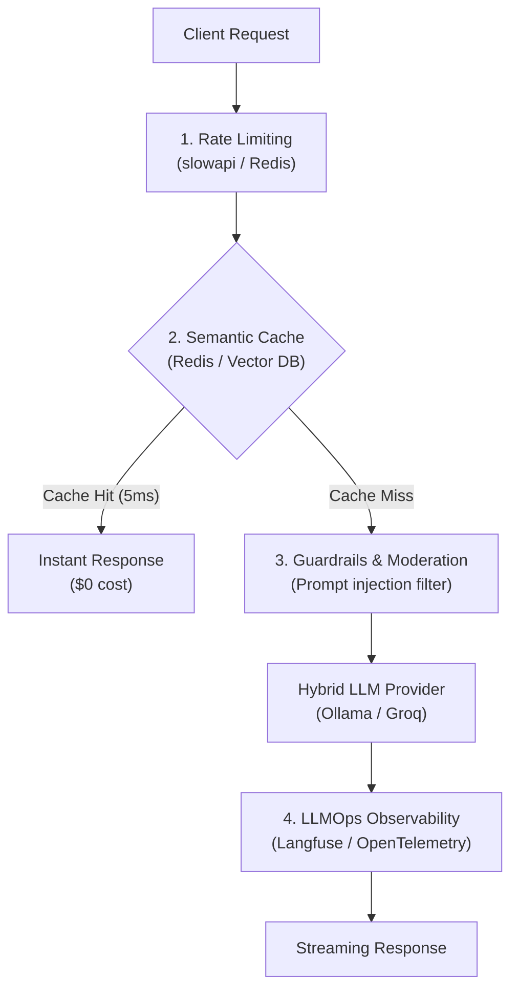

```mermaid
flowchart TD
    User["Client Request"] --> RateLimit["1. Rate Limiting\n(slowapi / Redis)"]
    RateLimit --> SemanticCache{"2. Semantic Cache\n(Redis / Vector DB)"}
    SemanticCache -->|"Cache Hit (5ms)"| FastReply["Instant Response\n($0 cost)"]
    SemanticCache -->|"Cache Miss"| Guardrails["3. Guardrails & Moderation\n(Prompt injection filter)"]
    Guardrails --> Provider["Hybrid LLM Provider\n(Ollama / Groq)"]
    Provider --> Observability["4. LLMOps Observability\n(Langfuse / OpenTelemetry)"]
    Observability --> Reply["Streaming Response"]
```
